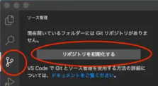

# githubへの共有手順

## 目次

- [Git操作](#git操作)
- [Githubに接続](#githubに接続)

この手順書はgitのインストールとgithubへの登録ができていることが前提です。

gitの登録手順はこちら  
↓↓↓↓↓↓↓↓

[インストール](https://www.curict.com/item/60/60bfe0e.html)

github登録手順  
↓↓↓↓↓↓↓↓

[登録](https://pengi-n.co.jp/column/design/github-account/)

gitをインストールしたら以下の手順で設定をする。

コマンドプロンプト or Powrshell で以下を入力

- github に登録したメールアドレス設定
  
    `git config --global user.email "you@example.com"`

- github に登録したアカウントID設定
  
    `git config --global user.name "Your Name"`

- git のアカウント設定を確認
  
    `git config -l --global`

## Git操作

vscode内のターミナルで以下のコードを入力しリポジトリを初期化します。

`git init`

まずはvscodeを開きます
そして左の丸が三つある項目の
リポジトリを初期化するを押します

すると下の画像のようにvscodeで作成していたhtmlファイルなどがでてきます。
このファイルの＋ボタンを押します。

すると下の画像のようにステージングされます。

メッセージと書かれている欄にコミットメッセージを書いて
コミットします。

これでローカルリポジトリにコミットすることができました。

## Githubに接続

まずはgithubにログインします
そしてホームのNewというボタンを押してリモートリポジトリ作成します。

作成するとurlが出てくるのでコピーをしておく

vscodeのターミナルで以下のコードを入力する

    `git remote add origin コピーしたURL`

完了したら画像のボタンを押してpushしましょう

githubで結果が反映されていたら成功です

